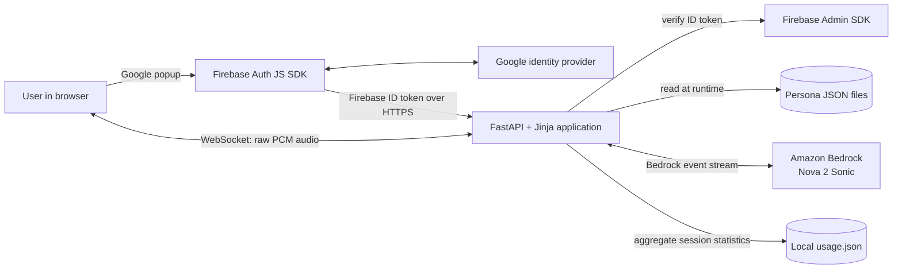
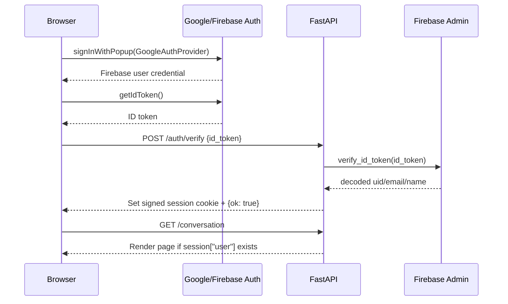
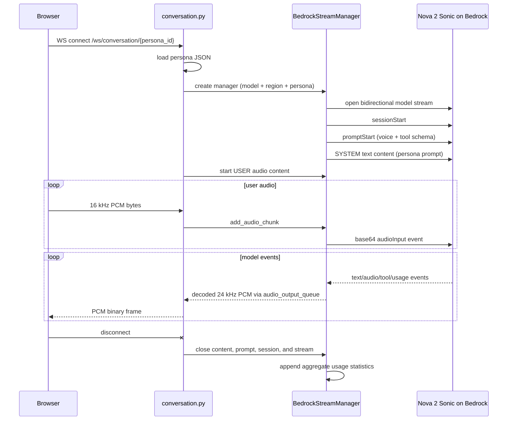

# History2Life Architecture

This document describes the system that exists in the repository today. It is intended to be the first reference for an engineer or coding agent adding features. `STRUCTURE.md` describes an intended directory layout; where it differs from this document, this document reflects the implemented code.

## 1. Product and current scope

History2Life is a server-rendered voice application in which an authenticated user selects a historical persona and has a real-time, bidirectional spoken conversation with it. The model is Amazon Nova 2 Sonic through the Amazon Bedrock bidirectional streaming API.

The repository is an early SaaS foundation rather than a complete multi-tenant SaaS product. It currently has Google sign-in and per-session identity, but it does not yet have subscriptions, organizations, entitlements, a user database, durable conversation history, or per-user usage records.

## 2. System context



There is one deployable application process. The browser is a thin client: Jinja renders HTML/CSS and serves a bundled JavaScript conversation client, while authentication verification and all AWS access happen on the server. The conversation page renders a procedural low-poly Three.js character; it does not download a persona-specific 3D asset.

## 3. Runtime topology

### Production application path

1. `Dockerfile` first uses Node to install pinned frontend dependencies and bundle `app/frontend/conversation.js`, then builds a Python 3.13 runtime image, installs `app/requirements.txt`, copies `app/` to `/app`, copies the generated browser bundle, and runs `uvicorn main:app` on port `8082`.
2. `app/main.py` creates FastAPI, installs signed-cookie sessions and CORS middleware, mounts `/static`, registers the auth and conversation routers, and exposes `/` and `/health`.
3. `docker-compose.yml` injects `.env`, publishes `${APP_PORT:-8082}`, mounts `app/data` for runtime data, and mounts the Firebase service-account file read-only.
4. AWS credentials are resolved from the process environment by the Smithy `EnvironmentCredentialsResolver`.

The current import layout assumes `app/` is the Python working directory or is on `PYTHONPATH`: application modules import `api...` and `services...`, not `app.api...` and `app.services...`. The container satisfies this because the contents of `app/` are copied directly into `/app`.

### Separate experiments

These are not part of the web application's request path:

- `sonic_demo/` is a standalone LiveKit/Amazon Sonic experiment with its own `pyproject.toml` and lockfile.
- `app/services/nova_hello_world.py` is a standalone, text-only Nova API example.
- `AudioStreamer` and the `main()` function at the bottom of `app/services/nova_tool_use.py` support direct local microphone/speaker use through optional PyAudio. The browser route uses `BedrockStreamManager`, not `AudioStreamer`.

Do not introduce a LiveKit dependency into the production request flow merely because the experiment exists; make that an explicit architecture decision first.

## 4. Source layout and ownership

| Path | Current responsibility |
| --- | --- |
| `app/main.py` | Application composition, middleware, static files, router registration, root redirect, health check |
| `app/api/routes/auth.py` | Login page, Firebase ID-token exchange, session creation, logout |
| `app/api/routes/conversation.py` | Persona page rendering and browser-to-Bedrock WebSocket bridge |
| `app/services/firebase_service.py` | Lazy Firebase Admin initialization and ID-token verification |
| `app/services/nova_tool_use.py` | Persona loading, Bedrock event protocol, async audio queues, tool calls, usage tracking, optional local audio CLI |
| `app/templates/login.html` | Firebase browser SDK setup and Google sign-in UI |
| `app/templates/conversation.html` | Conversation layout, responsive avatar stage, controls, and browser-bundle entry point |
| `app/frontend/conversation.js` | Microphone capture, PCM conversion, WebSocket lifecycle, output scheduling, analyser wiring, and cleanup |
| `app/frontend/low-poly-avatar.js` | Procedural Three.js character, idle animation, WebGL lifecycle, and mouth transform |
| `app/frontend/lip-sync.js` | Tested RMS calculation and attack/release speech envelope |
| `app/static/js/conversation.bundle.js` | Generated production browser bundle; rebuilt with `npm run build` |
| `app/data/personas/*.json` | Persona identity, voice, inference configuration, and system prompt |
| `app/static/images/personas/<id>.png` | Persona portrait selected by numeric persona ID |
| `app/data/usage.json` | Generated local aggregate/session usage log; intentionally gitignored |
| `tests/frontend/` | Node tests for deterministic frontend audio/lip-sync behavior |
| `tests/` | Python test skeleton; no route or service tests are implemented yet |
| `docs/` | Maintained architecture and engineering documentation |

Dependency direction for new code should remain:

```text
main -> routes -> services -> external systems / data
                  templates <- route render context
```

Routes should own transport concerns. Services should own reusable business logic and external integrations. Persona definitions should remain data, not Python branches. Shared request/response models belong under `app/api/schemas/`, although the only current Pydantic request model is still defined in `auth.py`.

## 5. HTTP and WebSocket surface

| Method | Path | Authentication | Behavior |
| --- | --- | --- | --- |
| `GET` | `/` | None | Redirects to `/conversation` |
| `GET` | `/health` | None | Returns `{"status": "healthy"}` |
| `GET` | `/login` | Redirects if already signed in | Renders Google sign-in page |
| `POST` | `/auth/verify` | Firebase ID token in JSON body | Verifies token and creates signed session cookie |
| `GET` | `/auth/logout` | None | Clears session and redirects to `/login` |
| `GET` | `/conversation` | Signed session required | Renders persona 1 |
| `GET` | `/conversation/{persona_id}` | Signed session required | Renders selected persona |
| `WS` | `/ws/conversation/{persona_id}` | **Not currently checked** | Bridges raw browser audio to one Nova Sonic stream |

The WebSocket endpoint accepts before validating the persona and does not check the signed user session. Treat WebSocket authentication and persona validation as required work before relying on the current page guard as a security boundary.

## 6. Authentication flow



Important contracts:

- The browser obtains the Firebase ID token; AWS and Firebase Admin credentials never belong in browser code.
- `SessionMiddleware` stores `uid`, `email`, and `name` in a signed cookie-backed session.
- `SESSION_SECRET` must be set in deployed environments. The code default, `change-me`, is development-only and unsafe for production.
- `FIREBASE_SERVICE_ACCOUNT` selects an explicit credential file. Without it, Firebase Admin initializes with a project ID and the environment's application-default credentials.
- The Firebase browser configuration is currently embedded in `login.html`. Firebase browser configuration is not an admin secret, but environment-specific configuration should eventually be injected rather than hardcoded.

## 7. Voice conversation flow

### Browser side

`app/frontend/conversation.js` owns the active browser audio session and `app/templates/conversation.html` supplies its DOM:

1. The user clicks the microphone button and grants microphone access.
2. The browser opens `ws(s)://<host>/ws/conversation/<persona_id>`.
3. An input `AudioContext` requests 16 kHz mono audio. A `ScriptProcessorNode` converts `Float32` samples to signed 16-bit PCM and sends each buffer as a binary WebSocket frame.
4. Binary frames received from the server are interpreted as signed 16-bit PCM at 24 kHz.
5. The browser schedules each output buffer after the previous buffer to reduce gaps. Every output source is connected through one `AnalyserNode` before the audio destination.
6. `LowPolyAvatar` reads the analyser's time-domain samples on each animation frame. `LipSyncEnvelope` maps RMS energy through a noise floor and asymmetric attack/release smoothing; the result opens the mouth cavity and lowers the lip/jaw in time with audio actually reaching playback.
7. The character remains visible while idle and uses subtle bob, head, and blink animation. `prefers-reduced-motion` disables the decorative idle motion while retaining speech mouth motion.
8. Stopping closes the socket, stops already scheduled output sources, disconnects the analyser, closes the mouth, closes both audio contexts, and stops microphone tracks.

The avatar is built from low-poly Three.js primitives rather than an external VRM in this first release. This keeps the bundle and asset pipeline simple, avoids model licensing/download failures, and still leaves `LowPolyAvatar` as the interface that can later be replaced with a VRM implementation.

Current wire contract:

| Direction | WebSocket payload | Audio format |
| --- | --- | --- |
| Browser to server | Binary frame | raw little-endian signed PCM, mono, 16-bit, nominally 16 kHz |
| Server to browser | Binary frame | raw little-endian signed PCM, mono, 16-bit, 24 kHz |

There are no JSON control frames, protocol version, transcript messages, structured errors, acknowledgements, or session IDs in the browser protocol. Any feature that needs those should first define an explicit versioned message protocol rather than overloading raw audio frames.

### Server and Bedrock side



`BedrockStreamManager` maintains three queues:

- `audio_input_queue`: browser PCM waiting to be base64-wrapped and sent to Bedrock.
- `audio_output_queue`: decoded Nova PCM waiting for the WebSocket send loop.
- `output_queue`: all decoded Bedrock events; currently no web component consumes it.

On initialization the manager sends, in order:

1. `sessionStart` using persona `max_tokens`, `top_p`, and `temperature`.
2. `promptStart` using persona `voice_id` and a tool schema.
3. A non-interactive SYSTEM text content block containing the persona `system_prompt`.
4. A USER audio content-start event.

The response processor handles audio, text, tool-use, interruption, completion, and token-usage events. Only audio is returned to the browser. Transcribed user text, assistant text, and token counters are currently printed server-side or placed on the unconsumed `output_queue`.

The advertised tool set currently contains only `getDateAndTimeTool`. `ToolProcessor` also contains demo order-tracking behavior, but that tool is not advertised in `promptStart` and is therefore not part of the active model contract.

## 8. Persona model

Each `app/data/personas/*.json` file currently has this shape:

| Field | Used by | Notes |
| --- | --- | --- |
| `id` | Route lookup, selector, image path | Must be unique; current IDs are numeric |
| `persona_name` | Conversation page | Display name |
| `voice_id` | Bedrock `audioOutputConfiguration` | Falls back to `matthew` |
| `speech_pause_length` | Nothing currently | Reserved/dead configuration at present |
| `temperature` | Bedrock session inference config | Falls back to `0.7` |
| `max_tokens` | Bedrock session inference config | Falls back to `1024` |
| `top_p` | Bedrock session inference config | Falls back to `0.9` |
| `system_prompt` | Bedrock SYSTEM content | Falls back to a generic assistant prompt |

Persona files are scanned on every list or lookup; there is no cache, schema validation, or database. Malformed files are silently skipped. An unknown ID returns an empty dictionary, which creates a generic assistant with a blank display name instead of a 404.

To add a persona under the current design:

1. Add a JSON file with a unique numeric `id` and all fields above.
2. Add `app/static/images/personas/<id>.png`.
3. Choose a Nova Sonic-supported `voice_id` for the configured model and region.
4. Keep the prompt optimized for spoken output: concise responses and no visual formatting.
5. Add validation/tests for the ID, required fields, inference ranges, and image mapping.

## 9. State and persistence

There is no application database.

| State | Location | Lifetime / limitation |
| --- | --- | --- |
| Authenticated user | Signed session cookie | Browser session/cookie lifetime; not a server-side user record |
| Active model stream | `BedrockStreamManager` in one worker process | One WebSocket connection |
| Persona catalog | JSON files on local filesystem | Deployment contents; compose mount permits local edits |
| Token/duration stats | `app/data/usage.json` | Local aggregate file, not tied to a user or persona |
| Conversation transcript | Not persisted | Text events are only logged/queued during the process |

`usage.json` uses a read-modify-write cycle with no file lock. Concurrent sessions or multiple Uvicorn/container instances can overwrite each other's updates. It is suitable for demo telemetry only, not billing, quotas, analytics, or audit history.

For SaaS features, introduce a durable store and explicit domain models rather than extending `usage.json`. At minimum, model users, plans/entitlements, conversation sessions, and metered usage. Associate each WebSocket session with the verified user before recording billable usage.

## 10. Configuration and secrets

The committed configuration contract is `.env.example`:

- `AWS_ACCESS_KEY_ID`, `AWS_SECRET_ACCESS_KEY`, `AWS_DEFAULT_REGION`
- `NOVA_API_KEY` (used only by the standalone text example)
- `FIREBASE_PROJECT_ID`, `FIREBASE_SERVICE_ACCOUNT`
- `SESSION_SECRET`
- `ALLOWED_ORIGINS`
- `APP_ENV`, `APP_PORT`, `LOG_LEVEL`

Current implementation notes:

- The active Bedrock WebSocket path uses AWS credentials, not `NOVA_API_KEY`.
- The active model ID and region are hardcoded in `conversation.py` as `amazon.nova-2-sonic-v1:0` and `us-east-1`; `AWS_DEFAULT_REGION` does not override them.
- `APP_PORT` is consumed by scripts/Compose, while Uvicorn inside the container always listens on `8082`.
- `APP_ENV` and `LOG_LEVEL` are documented but not read by application code.
- Never commit `.env`, Firebase Admin service-account JSON, certificates, or AWS credentials. The Firebase Admin filename pattern is gitignored.

## 11. Concurrency, scaling, and lifecycle

- Each WebSocket creates one `BedrockStreamManager` and one upstream Bedrock bidirectional stream.
- The route runs one receive task and one send task and cancels the peer when either finishes.
- Audio is buffered in unbounded `asyncio.Queue` instances, so a slow upstream/downstream consumer can cause memory growth.
- The stream manager starts response and audio-input background tasks. Not all created tasks are retained for explicit cancellation.
- Session state is cookie-based, so HTTP requests do not require sticky sessions. Active WebSockets are inherently bound to one worker for their lifetime.
- The local usage file prevents reliable horizontal aggregation.
- There is no explicit connection limit, per-user quota, timeout, rate limit, backpressure policy, or AWS-cost guardrail.

Before horizontal production scaling, add authenticated WebSocket admission, bounded queues/backpressure, connection/session timeouts, centralized usage persistence, structured observability, and graceful shutdown of all stream tasks.

## 12. Security and privacy boundaries

Current trust boundaries:

1. The browser and all browser-supplied persona IDs/audio are untrusted.
2. Firebase Admin token verification establishes identity for the HTTP session.
3. The FastAPI server is the only component that should hold Firebase Admin and AWS credentials.
4. User audio leaves the application boundary and is processed by Amazon Bedrock.
5. Persona prompts are trusted repository data, but should still be validated before constructing upstream events.

Known gaps to account for in feature work:

- The WebSocket route does not enforce authentication.
- Persona IDs are not rejected when unknown.
- There is no CSRF strategy documented for state-changing cookie-authenticated HTTP endpoints.
- No retention/consent policy is represented in code for voice, transcripts, or analytics.
- Errors are printed rather than emitted through structured, redacted logging.
- The default session secret is unsafe outside local development.
- CORS configuration does not itself authenticate or authorize WebSocket origins.

## 13. Testing and operational checks

The `tests/` tree currently contains only package markers and a `TestClient` fixture. No behavior is covered yet.

`test_docker.sh` is also stale: it expects `GET /` to return a JSON `{"status":"ok"}` response, but the implemented route redirects to `/conversation`, which then redirects unauthenticated users to `/login`. The `/health` assertion still matches the application.

Minimum test seams for future work:

- Route tests: login redirects, valid/invalid token exchange, logout, authenticated conversation rendering, missing persona behavior.
- WebSocket tests: authentication, binary format, disconnect cleanup, upstream failure, bounded buffering.
- Service tests: persona schema/uniqueness, Bedrock initialization event order and values, audio base64 encoding/decoding, tool events, token accounting.
- Template/browser tests: microphone denial, socket errors, cleanup, sample-rate conversion behavior, persona switching.
- Deployment smoke test: image starts, `/health` succeeds, root redirect chain is expected.

Mock Firebase and Bedrock in automated tests. Do not call paid/credentialed external services from unit or route tests.

## 14. Feature development guide

### Adding an HTTP feature

1. Put transport handling in `app/api/routes/<feature>.py`.
2. Put reusable logic and external API access in `app/services/`.
3. Put Pydantic transport models in `app/api/schemas/` when shared or non-trivial.
4. Register the router in `app/main.py`.
5. Add mocked route and service tests.
6. Document every new environment variable in `.env.example`.

### Changing the voice protocol

1. Define the new browser/WebSocket contract first, including versioning and message types.
2. Preserve or explicitly migrate the 16 kHz input and 24 kHz output assumptions.
3. Update both `conversation.html` and `conversation.py`; neither side can change independently.
4. Keep Bedrock-specific event construction inside the service layer.
5. Test interruption, disconnect, upstream error, queue pressure, and cleanup paths.

### Adding transcripts or conversation history

1. Consume normalized text events from the stream manager instead of scraping logs.
2. Create a server-generated conversation/session ID associated with the authenticated user.
3. Persist finalized turns in a durable database with an explicit retention policy.
4. Extend the WebSocket protocol with typed transcript/control messages; raw binary-only frames are insufficient.
5. Decide whether speculative/interrupted output is displayed or persisted.

### Adding plans, quotas, or billing

1. Create durable user, entitlement, conversation, and usage models.
2. Authenticate the WebSocket before opening a paid Bedrock stream.
3. Check entitlement and concurrency limits before upstream connection creation.
4. Record metering transactionally by user and conversation; do not use `usage.json` as a ledger.
5. Reconcile application metering with provider-side usage and make retries/idempotency explicit.

### Adding a Bedrock tool

1. Add its JSON schema to `promptStart.toolConfiguration.tools`.
2. Implement it behind a narrow service interface; do not place domain behavior directly in the event parser.
3. Validate model-provided arguments as untrusted input.
4. Add timeouts, cancellation, and safe error results.
5. Test the tool-use start/result/end event sequence.

## 15. Near-term architecture priorities

Recommended order before broad feature expansion:

1. Enforce signed-session authentication and allowed-origin checks on the WebSocket before accepting it.
2. Add typed persona validation and return explicit not-found errors.
3. Extract the Bedrock streaming client from the large demo-derived `nova_tool_use.py` into focused service modules without changing the wire contract.
4. Define a versioned WebSocket protocol that can carry audio, transcripts, errors, and lifecycle events.
5. Introduce durable user/session/usage persistence for SaaS metering.
6. Add unit, route, and WebSocket tests and repair the Docker smoke test.
7. Move model ID, region, Firebase browser config, limits, and timeouts into validated settings.
8. Add structured logs and metrics for connection count, latency, upstream errors, token usage, and cleanup.

## 16. Architectural invariants and required target states

Preserve these unless an explicit decision changes them:

- Browser code never receives AWS or Firebase Admin credentials.
- **Required target state:** every paid upstream voice stream is tied to an authenticated user. The current conversation WebSocket does not yet enforce this invariant and must not be treated as production-safe until it does.
- Routes translate transports; services own integrations and business rules.
- Persona behavior is data-driven and schema-validated.
- Audio format and protocol changes are coordinated across browser, WebSocket route, and Bedrock adapter.
- External services are mocked in automated tests.
- Usage used for quotas or billing is durable, attributable, and transactionally recorded.
- Experimental paths (`sonic_demo`, local PyAudio, text hello-world) do not silently become production dependencies.
- Secrets and generated runtime state remain outside version control.

When implementation and this file diverge, update this file in the same change that alters the architecture.
